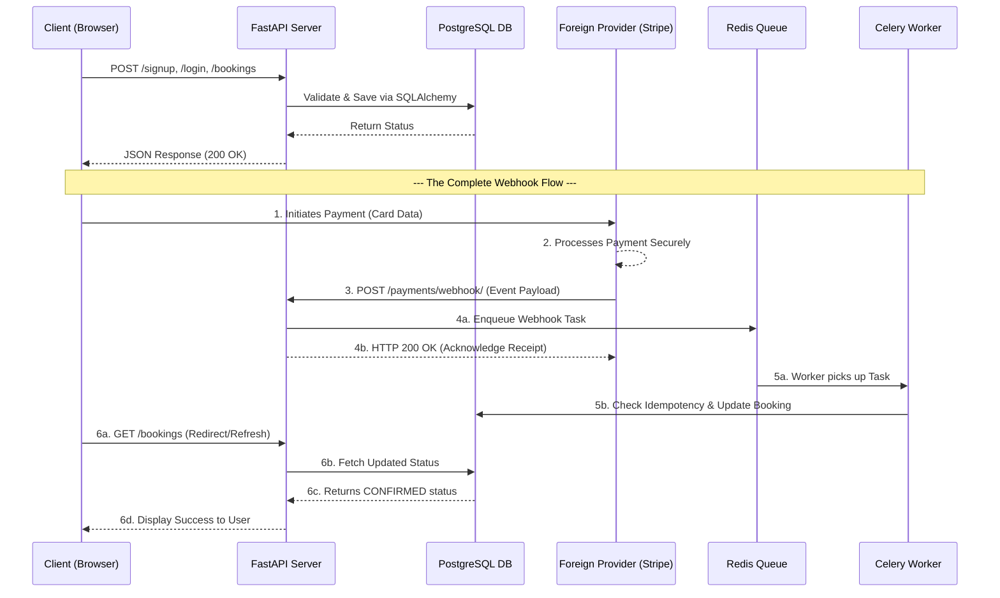

# Technical Interview Cheat Sheet
**EVE Healthcare Backend Architecture**

This document provides a strictly technical breakdown of the system architecture, web communication patterns, and advanced features implemented in this assignment.

---

## System Architecture Overview

The application follows a modern, decoupled backend architecture consisting of the following core components:
*   **The Client:** The frontend web browser or mobile application making HTTP requests.
*   **The Web Server (FastAPI / Uvicorn):** An asynchronous Python web framework that routes incoming HTTP requests, validates payloads, and returns JSON responses.
*   **The Database (PostgreSQL):** A highly concurrent relational database used for persistent data storage.
*   **The ORM (SQLAlchemy):** The Object-Relational Mapper that bridges the Python application layer to the PostgreSQL database layer, allowing for programmatic SQL execution.
*   **The Message Broker (Redis):** An in-memory data store used to queue background tasks.
*   **The Background Worker (Celery):** An asynchronous worker process that consumes tasks from the Redis queue and executes heavy database operations in the background, freeing up the FastAPI server to respond to web traffic immediately.
---
## 1. Security & Authentication Architecture
The application implements a stateless authentication system utilizing **JSON Web Tokens (JWT)** and **OAuth2** standards.

### Registration vs Login Flow
1. **Registration (POST /signup)**: 
   When a user registers, their password is cryptographically hashed using the **Bcrypt** algorithm before being saved to the database. 
   *Return Payload:* The signup route does **not** return an authentication token. It strictly returns the newly created User object (e.g., id, email, is_active), while ensuring the hashed password is stripped from the response. This intentional separation of concerns forces the client application to explicitly route the user through the formal login flow.

2. **Authentication (POST /login)**:
   Strictly following the OAuth2 specification, this route requires username and password via application/x-www-form-urlencoded Form Data. Upon successful Bcrypt verification, the server generates and returns a cryptographically signed JWT.

### Stateless Route Protection
Protected endpoints (like booking a test) are guarded by a FastAPI dependency (get_current_user). 
* When a request arrives, the dependency extracts the JWT from the Authorization: Bearer header.
* The server mathematically verifies the token's HS256 signature using its internal SECRET_KEY. 
* Because the JWT payload contains the user's ID, the server can authenticate the user instantly without needing to maintain server-side session memory. This makes the backend highly scalable.
---

## 2. Containerization (Docker)
The entire infrastructure is containerized using Docker. 
Instead of configuring local environments, `docker-compose up` orchestrates a private virtual network containing 4 isolated containers (`db`, `redis`, `web`, `worker`). This guarantees cross-platform consistency and eliminates deployment issues.

---

## 3. Web Communication Patterns
1. **Standard Synchronous HTTP:** The Client sends a request to the Server, the Server processes it, and immediately returns a response (e.g., standard login or fetching tests).
2. **Polling:** A legacy pattern for checking background task statuses. The Client continuously sends HTTP requests to a Server (e.g., every 5 seconds) asking for updates. This is highly inefficient and wastes network bandwidth.
3. **Webhooks (Event-driven Push):** The modern solution to polling. Instead of the Client repeatedly asking for updates, the Client provides a listening URL. The exact millisecond an external event completes, the external Server pushes an HTTP POST request directly to the listening URL.

---

## 4. The Complete Webhook & Routing Flow (End-to-End)

In a real-world scenario, webhooks involve your server and a foreign provider (like Stripe). Here is the exact sequential flow from start to finish:

1. **Client to Foreign Provider:** The Client (User's browser) initiates a payment, sending their credit card payload directly to the Foreign Provider (Stripe).
2. **Processing:** The Foreign Provider securely processes the transaction with the banking network. Our FastAPI server does nothing during this time.
3. **Foreign Provider to Our Server (The Webhook):** Upon success or failure, the Foreign Provider's server generates an HTTP POST request and sends it across the internet to our FastAPI Server's webhook endpoint (`/payments/webhook/`).
4. **Our Server to Foreign Provider (The Response):** Our FastAPI server receives the payload, instantly drops the data into a Redis queue, and immediately sends an HTTP `200 OK` response **back to the Foreign Provider** (to acknowledge receipt). *Note: Standard HTTP dictates that the response must go back to the server that made the request.*
5. **Background Processing:** The Celery worker picks up the task from Redis and safely updates the PostgreSQL database booking status to `CONFIRMED`.
6. **Client Sees the Update:** Because the webhook response went to Stripe, the Client's browser relies on a frontend redirect (e.g., a "Success Page"). That page makes a standard `GET /bookings` request to our server, fetching the newly updated database status to display to the user.

***Note on Assignment Implementation:** While the diagram and steps above illustrate the real-world architecture, for this assignment we built a mock `POST /payments/` endpoint to simulate the transaction. To test the webhook, we act as the "foreign provider" ourselves by manually sending test payloads to `POST /payments/webhook/` via Swagger UI to prove the backend logic works locally.*

---

## 5. Idempotency & Retry Handling
Network volatility requires robust error handling on both sides of the webhook transaction.

### Handling External Retries (Idempotency)
If Step 4 (Our Server to Foreign Provider) is interrupted by a network failure, the Foreign Provider will assume we never received the webhook. Their automated systems will repeatedly retry sending the exact same webhook request.
*   **Implementation:** Our API utilizes **Idempotency** to prevent duplicate processing. Every webhook payload contains a unique `event_id`. Before Celery updates the booking, it queries the `processed_webhooks` database table. If the `event_id` exists, the task is dropped to prevent data corruption. If it does not exist, the database is updated, and the `event_id` is saved permanently.

### Handling Internal Retries (Celery)
If the PostgreSQL database is temporarily offline or locked the exact millisecond the Celery worker attempts to update the booking, a standard API would drop the webhook entirely.
*   **Implementation:** Our Celery worker catches the database exception and utilizes a **retry decorator with exponential backoff**. It will hold the webhook payload and automatically retry the database insertion later, guaranteeing no data loss.

---

## 6. Advanced Features Implemented
*   **Structured Logging (`structlog`):** Outputs application logs in a machine-readable JSON format, enabling seamless integration with monitoring platforms like Datadog or ELK stacks.
*   **Rate Limiting (`slowapi`):** Protects authentication endpoints (`/signup`, `/login`) and webhook receivers by enforcing strict IP-based request limits (e.g., 10 requests per minute) to mitigate brute-force and DDoS attacks.
*   **Cursor Pagination:** Implemented `skip` and `limit` parameters on all `GET` routes. This ensures that querying thousands of diagnostic tests or bookings does not result in memory exhaustion on the server or browser.

---

## 7. Dependency Breakdown (`requirements.txt`)
*   **`fastapi` / `uvicorn`:** The core ASGI web framework and the underlying web server executing it.
*   **`sqlalchemy` / `psycopg2-binary`:** The Object-Relational Mapper and the native PostgreSQL driver.
*   **`celery` / `redis`:** The distributed task queue worker and the in-memory message broker.
*   **`slowapi` / `structlog`:** The rate-limiting engine and JSON logging engine.
*   **`pydantic`:** Enforces strict data typing and schema validation for all JSON payloads.
*   **`python-jose[cryptography]` / `passlib[bcrypt]`:** Cryptographic libraries utilized for generating JWT access tokens and hashing user passwords.
*   **`pytest` / `httpx`:** Frameworks utilized for automated unit and integration testing.

## 8. Production Architecture (Asynchronous)
The production environment is orchestrated via Docker Compose and consists of 4 isolated containers:
* **FastAPI Server** (Web traffic)
* **PostgreSQL** (Relational Database)
* **Redis** (In-memory Message Broker)
* **Celery** (Background Task Worker)

### The Non-Blocking Webhook Flow
In this environment, webhooks are completely **asynchronous**.
1. A payment provider (e.g., Stripe) sends a webhook payload to the FastAPI Server.
2. FastAPI calls `process_webhook_task.delay()`.
3. The payload is instantly serialized and pushed into the **Redis** queue.
4. FastAPI immediately returns a `200 OK` to the provider (typically in < 5ms).
5. The **Celery** worker detects the task in Redis and updates the PostgreSQL database independently.
    
*Benefit:* This "fire-and-forget" non-blocking architecture ensures the web server can handle thousands of concurrent requests without being bogged down by slow database operations.

---

##  Local Development Architecture (Synchronous)
To facilitate rapid testing for developers who do not have Docker or Redis installed, the application includes a `run_local.py` script.

### The Blocking Webhook Flow
Running this script alters the application state dynamically:
* It overrides `DATABASE_URL` to point to a local `sqlite:///./local_dev.db`.
* It sets `celery.conf.task_always_eager = True`.

In this environment, webhooks are forced to be **synchronous**:
1. A webhook payload hits the FastAPI Server.
2. FastAPI calls `process_webhook_task.delay()`.
3. Because of the eager configuration, Celery bypasses Redis entirely and executes the heavy database update in the **exact same memory thread**.
4. The FastAPI server is **blocked** and must wait until the database finishes updating before it can return the `200 OK` response.

*Benefit:* While terrible for production traffic, this blocking architecture is highly desirable for local debugging and automated tests (like `pytest`). It guarantees that when a developer clicks "Execute" in Swagger UI, the database is 100% updated the precise moment they see the `200 OK` response.
